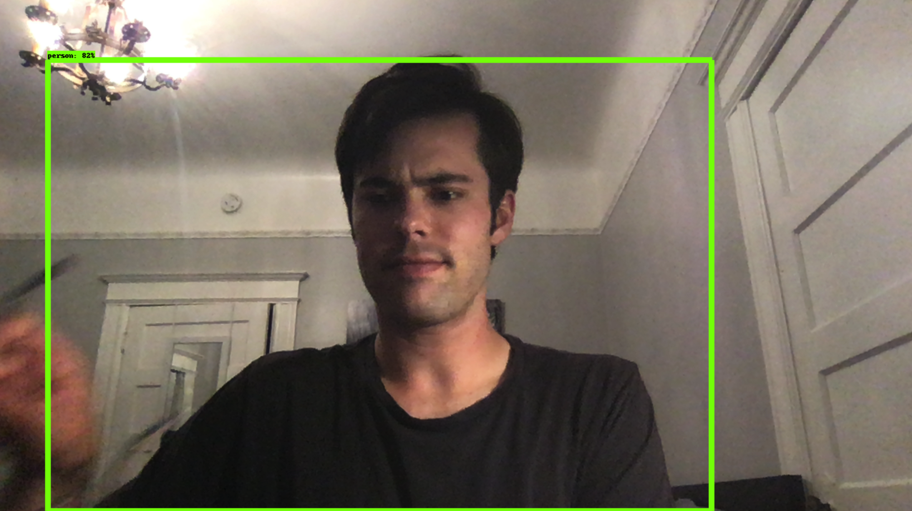
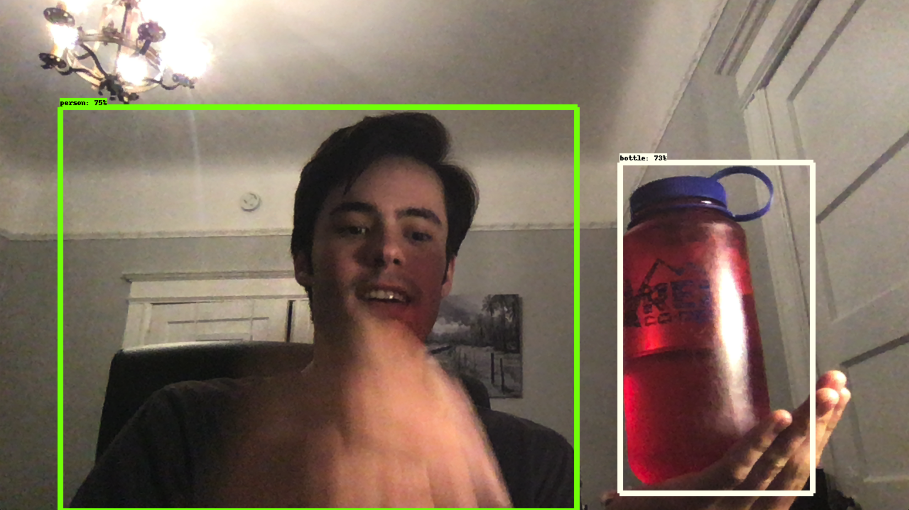

# Face/Object Detection App

Detects objects in real time using [OpenCV](https://opencv.org) and [Google's TensorFlow Object Detection API](https://github.com/tensorflow/models/tree/master/research/object_detection).

I adapted TensorFlow's Object Detection to detect live video from my laptop webcam.

## How To Use

1. `mkvirtualenv face-detection`
2. `workon face-detection`
2. `pip install -r requirements.txt`
3. run `jupyter notebook`

## Requirements

- Python 2.7.0
- [Anaconda](https://www.anaconda.com/distribution/)
- [TensorFlow Version >= 1.12](https://www.tensorflow.org/install)
- [OpenCV4](https://www.pyimagesearch.com/2018/08/17/install-opencv-4-on-macos/)

## Notes
- I was inspired to build my own version of this project by [Dat Tran's Article](https://towardsdatascience.com/building-a-real-time-object-recognition-app-with-tensorflow-and-opencv-b7a2b4ebdc32).

## Results

Doubtful that it's actually working...

Ah yes, it actually works!
